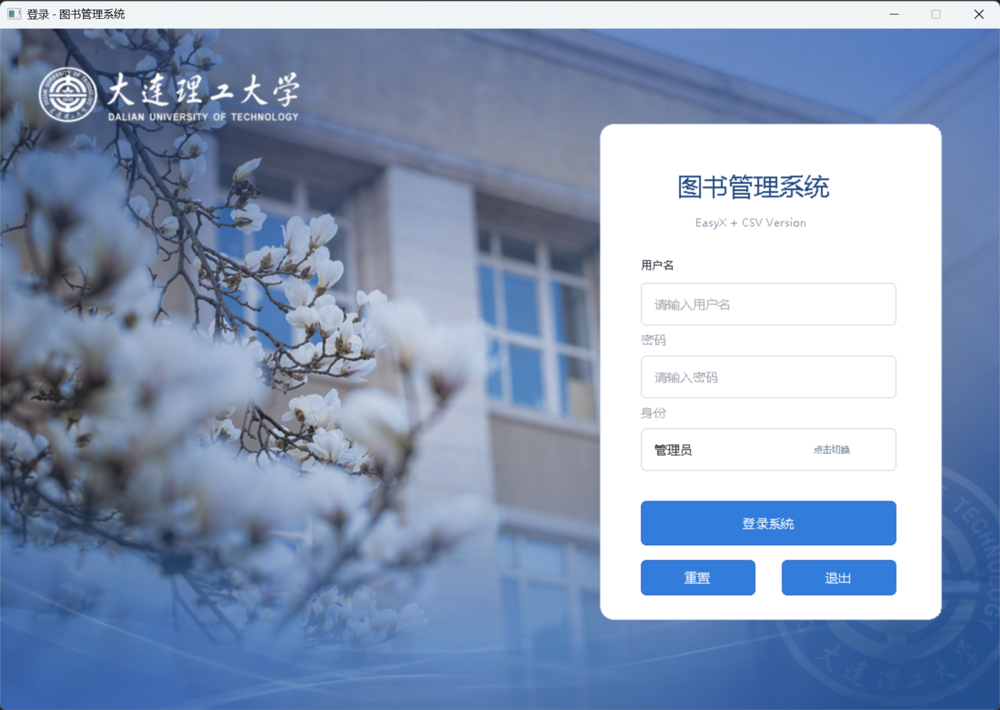
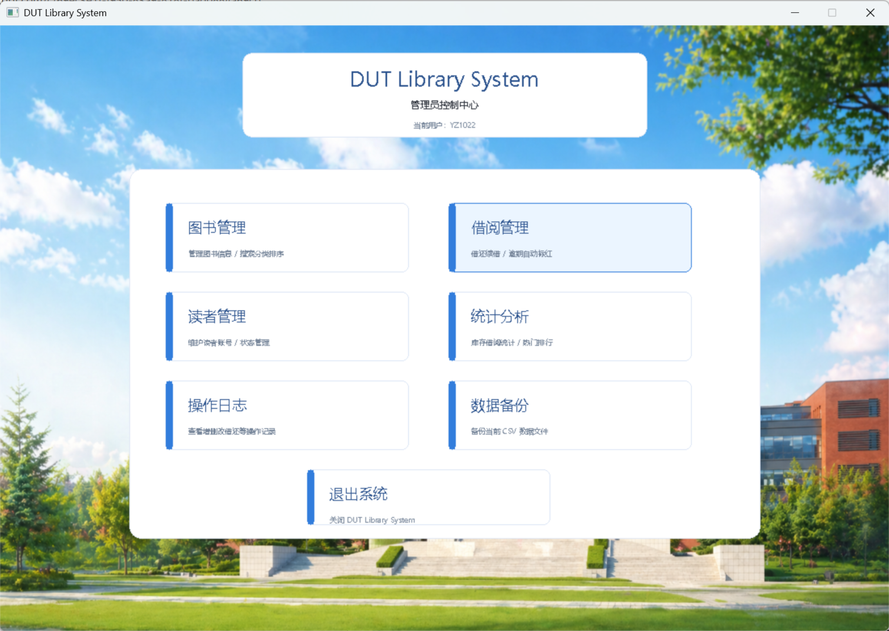
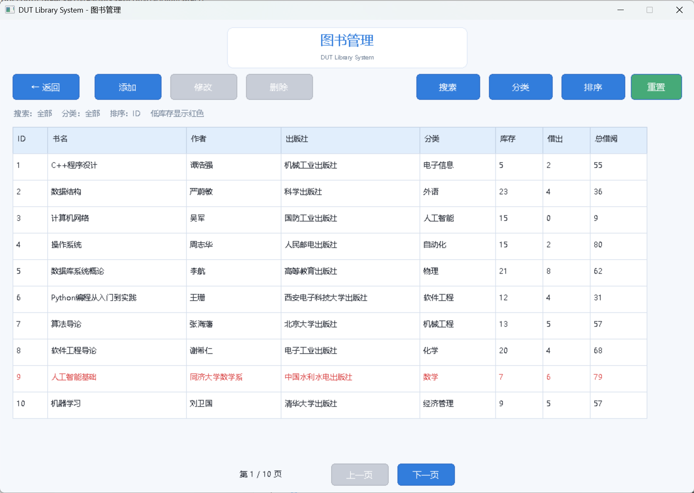
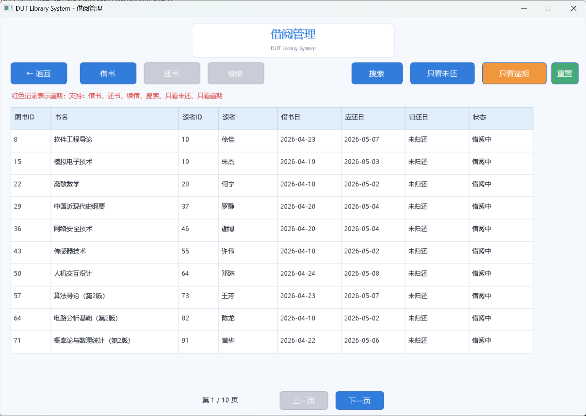
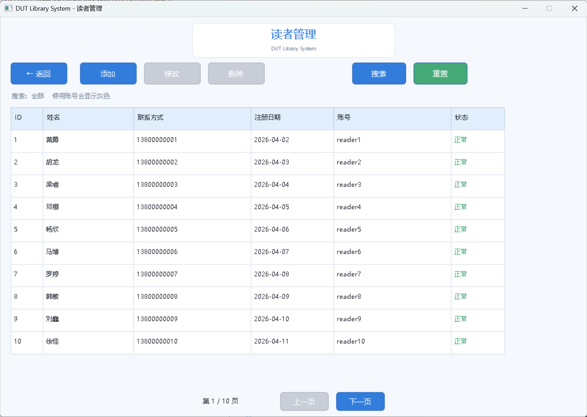
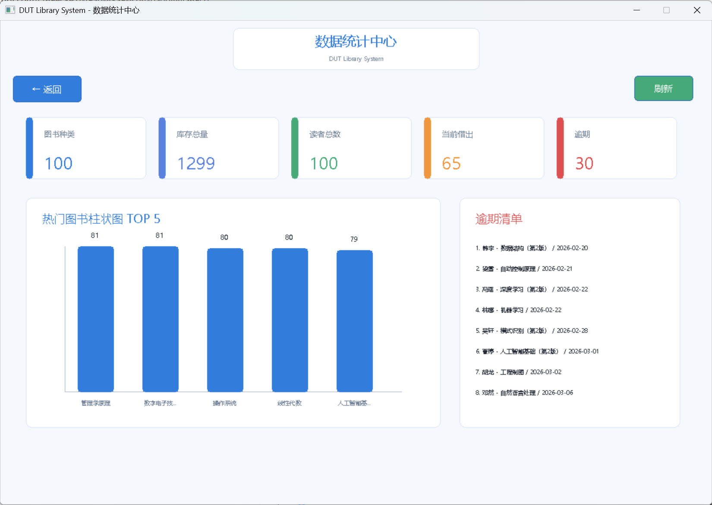
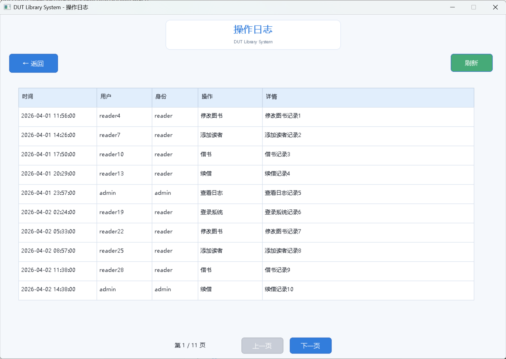
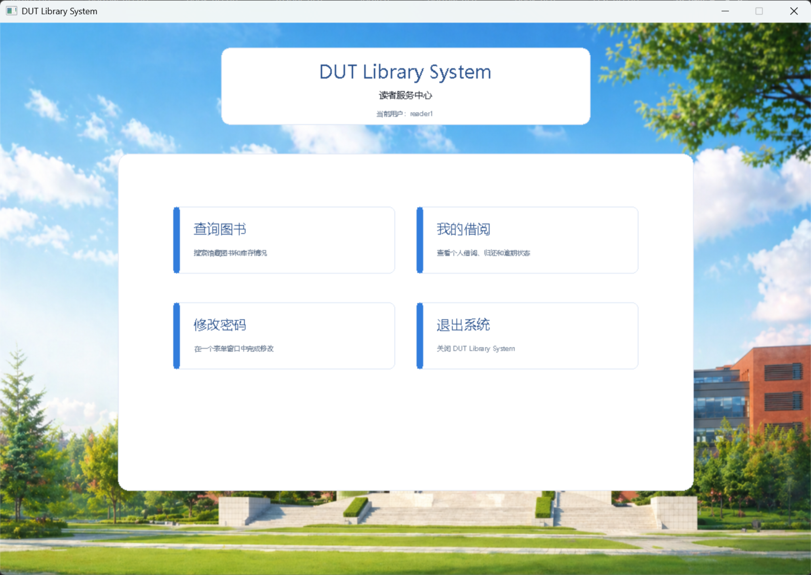

# 📚 LibrarySystem 图书管理系统


---

## 📖 项目简介

**LibrarySystem 图书管理系统** 是一个基于 **C++ + EasyX 图形库** 开发的图形化图书管理系统。

系统支持 **管理员端** 和 **读者端** 两种身份登录。管理员可以完成图书管理、借阅管理、读者管理、数据统计、操作日志查看和数据备份等功能；读者可以查询图书、查看个人借阅记录以及修改密码。

项目数据采用 **CSV 文件** 进行本地存储，不依赖数据库，结构清晰、易于维护，适合作为 **C++ 课程设计、大一程序设计项目、EasyX 图形界面练习项目** 使用。

---

## 🖼️ 项目界面展示

> 建议将项目截图放在 `docs/images/` 目录下。  
> 图片文件名建议使用英文，不要使用中文、空格或特殊符号。

| 登录界面 | 管理员主界面 |
|---|---|
|  |  |

| 图书管理 | 借阅管理 |
|---|---|
|  |  |

| 读者管理 | 数据统计中心 |
|---|---|
|  |  |

| 操作日志 | 读者服务中心 |
|---|---|
|  |  |

---

## 🚀 功能介绍

### 👤 用户登录

| 功能 | 功能 | 功能 |
|---|---|---|
| 管理员账号登录 | 读者账号登录 | 管理员 / 读者身份切换 |
| CSV 文件账号验证 | 登录失败错误提示 | 读者逾期自动提醒 |

---

### 📚 图书管理

| 功能 | 功能 | 功能 | 功能 |
|---|---|---|---|
| 添加图书 | 删除图书 | 修改图书信息 | 查询图书 |
| 分类筛选 | 排序显示 | 分页浏览 | 低库存红色提示 |

| 图书信息 | 图书信息 | 图书信息 | 图书信息 |
|---|---|---|---|
| 图书 ID | 书名 | 作者 | 出版社 |
| 分类 | 库存数量 | 当前借出数量 | 累计借阅次数 |

---

### 📖 读者管理

| 功能 | 功能 | 功能 | 功能 |
|---|---|---|---|
| 添加读者 | 删除读者 | 修改读者信息 | 查询读者 |
| 查看账号状态 | 正常账号管理 | 停用账号管理 | 分页浏览 |

| 读者信息 | 读者信息 | 读者信息 | 读者信息 |
|---|---|---|---|
| 读者 ID | 姓名 | 联系方式 | 注册日期 |
| 登录账号 | 登录密码 | 账号状态 |  |

---

### 🔄 借阅管理

| 功能 | 功能 | 功能 | 功能 |
|---|---|---|---|
| 借书 | 还书 | 续借 | 查询借阅记录 |
| 只看未还 | 只看逾期 | 逾期红色提示 | 分页浏览 |

| 借阅规则 | 借阅规则 |
|---|---|
| 图书不存在时不能借阅 | 读者不存在时不能借阅 |
| 停用账号不能借阅 | 库存不足时不能借阅 |
| 存在逾期图书时不能继续借阅 | 每位读者最多同时借阅 5 本图书 |
| 默认借阅期限为 14 天 | 每次续借延长 7 天 |

---

### 📊 数据统计

| 统计功能 | 统计功能 | 统计功能 |
|---|---|---|
| 图书种类统计 | 库存总量统计 | 读者总数统计 |
| 当前借出数量统计 | 当前逾期数量统计 | 热门图书 TOP 5 |
| 柱状图展示 | 逾期清单展示 |  |

---

### 📝 操作日志

| 日志内容 | 日志内容 | 日志内容 |
|---|---|---|
| 操作时间 | 操作用户 | 用户身份 |
| 操作类型 | 操作详情 | 系统关键操作记录 |

| 日志类型 | 日志类型 | 日志类型 | 日志类型 |
|---|---|---|---|
| 登录系统 | 添加图书 | 修改图书 | 删除图书 |
| 添加读者 | 修改读者 | 删除读者 | 借书 |
| 还书 | 续借 | 查看日志 |  |

---

### 💾 数据备份

| 功能 | 功能 | 功能 |
|---|---|---|
| 一键备份 CSV 数据文件 | 自动创建 `backup` 目录 | 便于恢复历史数据 |

---

## 🛠️ 开发环境

| 项目 | 说明 | 项目 | 说明 |
|---|---|---|---|
| 编程语言 | C++ | C++ 标准 | C++17 |
| 开发工具 | Visual Studio 2022 | 图形库 | EasyX |
| 数据存储 | CSV 文件 | 操作系统 | Windows 10 / Windows 11 |
| 推荐平台 | x64 | 推荐字符集 | Unicode |

---

## 📂 项目结构

```text
LibrarySystem/
│
├── src/                         # 源代码文件
│   ├── main.cpp                 # 程序入口与主菜单
│   ├── login.cpp                # 登录界面与登录验证
│   ├── book_ui.cpp              # 图书管理界面
│   ├── borrow_ui.cpp            # 借阅管理界面
│   ├── reader_ui.cpp            # 读者管理界面
│   ├── stat_ui.cpp              # 数据统计界面
│   └── log_ui.cpp               # 操作日志界面
│
├── include/                     # 头文件
│   ├── login.h                  # 登录模块声明
│   ├── book_ui.h                # 图书管理模块声明
│   ├── borrow_ui.h              # 借阅管理模块声明
│   ├── borrow_record.h          # 借阅记录结构体
│   ├── reader_ui.h              # 读者管理模块声明
│   ├── stat_ui.h                # 数据统计模块声明
│   ├── log_ui.h                 # 操作日志模块声明
│   └── ui_utils.h               # 公共 UI 工具函数
│
├── data/                        # CSV 数据文件
│   ├── admin_accounts.csv       # 管理员账号数据
│   ├── books.csv                # 图书信息数据
│   ├── readers.csv              # 读者信息数据
│   ├── borrow_records.csv       # 借阅记录数据
│   └── logs.csv                 # 操作日志数据
│
├── picture/                     # 程序背景图片资源
│   ├── login.png                # 登录界面背景图
│   └── bgImg.png                # 主菜单背景图
│
├── Easyx/                       # EasyX 图形库
│   ├── include/
│   │   ├── easyx.h
│   │   └── graphics.h
│   │
│   └── lib/
│       └── VC2015/
│           └── X64/
│               ├── EasyXa.lib
│               └── EasyXw.lib
│
├── docs/                        # README 展示图片
│   └── images/
│       ├── login.png
│       ├── admin_menu.png
│       ├── book_manage.png
│       ├── borrow_manage.png
│       ├── reader_manage.png
│       ├── statistics.png
│       ├── logs.png
│       └── reader_menu.png
│
├── backup/                      # 数据备份目录，运行后自动生成
│
├── LibrarySystem.sln            # Visual Studio 解决方案文件
├── LibrarySystem.vcxproj        # Visual Studio 项目文件
└── README.md                    # 项目说明文档
```

---

## 📊 数据文件说明

所有数据均存储在 `data/` 目录下的 CSV 文件中。

| 文件名 | 说明 |
|---|---|
| `admin_accounts.csv` | 管理员账号数据 |
| `books.csv` | 图书信息数据 |
| `readers.csv` | 读者信息数据 |
| `borrow_records.csv` | 借阅记录数据 |
| `logs.csv` | 操作日志数据 |

---

## 🧾 CSV 字段说明

### admin_accounts.csv

```csv
username,password,name,role
```

| 字段 | 说明 | 字段 | 说明 |
|---|---|---|---|
| username | 管理员账号 | password | 管理员密码 |
| name | 管理员名称 | role | 用户角色 |

---

### books.csv

```csv
id,title,author,publisher,category,stock,borrowed,totalBorrowed
```

| 字段 | 说明 | 字段 | 说明 |
|---|---|---|---|
| id | 图书编号 | title | 书名 |
| author | 作者 | publisher | 出版社 |
| category | 图书分类 | stock | 库存总数 |
| borrowed | 当前借出数量 | totalBorrowed | 累计借阅次数 |

---

### readers.csv

```csv
id,name,contact,regDate,username,password,status
```

| 字段 | 说明 | 字段 | 说明 |
|---|---|---|---|
| id | 读者编号 | name | 读者姓名 |
| contact | 联系方式 | regDate | 注册日期 |
| username | 登录账号 | password | 登录密码 |
| status | 账号状态 |  |  |

账号状态说明：

| 状态 | 含义 |
|---|---|
| normal | 正常账号 |
| disabled | 停用账号 |

---

### borrow_records.csv

```csv
bookId,bookTitle,readerId,readerName,borrowDate,dueDate,returnDate
```

| 字段 | 说明 | 字段 | 说明 |
|---|---|---|---|
| bookId | 图书编号 | bookTitle | 图书名称 |
| readerId | 读者编号 | readerName | 读者姓名 |
| borrowDate | 借书日期 | dueDate | 应还日期 |
| returnDate | 归还日期，空值表示未归还 |  |  |

---

### logs.csv

```csv
time,user,role,action,detail
```

| 字段 | 说明 | 字段 | 说明 |
|---|---|---|---|
| time | 操作时间 | user | 操作用户 |
| role | 用户身份 | action | 操作类型 |
| detail | 操作详情 |  |  |

---

## 🔑 默认账号

| 身份 | 账号 | 密码 | 说明 |
|---|---|---|---|
| 管理员 | `admin` | `123456` | 默认管理员账号 |
| 管理员 | `YZ1022` | `123456` | 备用管理员账号 |
| 读者 | `reader1` | `123456` | 默认读者账号 |

---

## ⚙️ 运行方法

### 方法一：Visual Studio 2022 运行

| 步骤 | 操作 |
|---|---|
| 1 | 使用 **Visual Studio 2022** 打开 `LibrarySystem.sln` |
| 2 | 将平台设置为 `x64` |
| 3 | 将字符集设置为 `Unicode` |
| 4 | 确保已配置 EasyX 头文件和库文件路径 |
| 5 | 点击 `本地 Windows 调试器` 或按 `F5` 运行 |

---

### 方法二：项目自带 EasyX 库运行

如果项目中已经包含 `Easyx/` 文件夹，需要确认以下配置正确。

| 配置项 | 内容 |
|---|---|
| 附加包含目录 | `$(ProjectDir)include` |
| 附加包含目录 | `$(ProjectDir)Easyx\include` |
| 附加库目录 | `$(ProjectDir)Easyx\lib\VC2015\X64` |
| 附加依赖项 | `EasyXw.lib` |

推荐使用：

```text
x64 + Unicode + EasyXw.lib
```

---

## 🔧 Visual Studio 配置说明

### 1. 设置 C++ 标准

| 设置项 | 内容 |
|---|---|
| 路径 | `项目属性 -> C/C++ -> 语言 -> C++ 语言标准` |
| 推荐设置 | `ISO C++17 标准 (/std:c++17)` |

---

### 2. 设置字符集

| 设置项 | 内容 |
|---|---|
| 路径 | `项目属性 -> 高级 -> 字符集` |
| 推荐设置 | `使用 Unicode 字符集` |

---

### 3. 设置平台

| 设置项 | 内容 |
|---|---|
| 推荐平台 | `x64` |
| 不推荐 | `Win32` |
| 原因 | 避免 EasyX 库文件平台不匹配 |

---

### 4. 设置调试工作目录

如果程序运行后找不到 `data`、`picture` 等目录，建议设置调试工作目录。

| 设置项 | 内容 |
|---|---|
| 路径 | `项目属性 -> 调试 -> 工作目录` |
| 推荐设置 | `$(ProjectDir)` |

---

## 📌 项目特点

| 特点 | 特点 |
|---|---|
| 使用 C++ 实现完整业务逻辑 | 基于 EasyX 实现图形化界面 |
| 使用 CSV 作为轻量级本地数据库 | 支持管理员和读者双身份系统 |
| 支持图书、读者、借阅、统计、日志、备份等完整功能 | 代码采用模块化设计，结构清晰 |
| 数据文件独立存放，便于维护和修改 | 适合课程设计、项目答辩和基础系统开发练习 |

---

## ⚠️ 注意事项

| 注意事项 | 注意事项 |
|---|---|
| 请确保使用 `x64` 平台运行 | 请确保 EasyX 路径配置正确 |
| 请勿删除 `data/` 目录 | 请勿删除 `Easyx/` 目录 |
| 程序运行时需要能够读取 CSV 文件 | 数据不更新时检查程序运行目录 |
| 中文乱码时检查 UTF-8 编码 | 背景图片不显示时检查 `picture/` 目录 |
| 图片不显示时检查 `docs/images/` 路径 | README 图片文件名建议使用英文 |

---

## ❓ 常见问题

### 1. 找不到 easyx.h 或 graphics.h

请检查附加包含目录是否添加：

```text
$(ProjectDir)Easyx\include
```

同时确认项目目录下存在：

```text
Easyx/include/easyx.h
Easyx/include/graphics.h
```

---

### 2. 找不到 EasyXw.lib

请检查附加库目录是否添加：

```text
$(ProjectDir)Easyx\lib\VC2015\X64
```

并确认目录下存在：

```text
EasyXw.lib
EasyXa.lib
```

如果使用的是 Unicode 字符集，推荐链接：

```text
EasyXw.lib
```

---

### 3. 运行后没有数据

请确认 `data/` 文件夹位于程序运行目录下。

| 解决方法 | 说明 |
|---|---|
| 设置工作目录 | 将调试工作目录设置为 `$(ProjectDir)` |
| 检查 data 目录 | 确保 `data/` 文件夹没有被删除 |
| 检查 CSV 文件 | 确保 CSV 文件存在且文件名正确 |

设置路径：

```text
项目属性 -> 调试 -> 工作目录
```

---

### 4. 背景图片不显示

请确认 `picture/` 文件夹存在，并且其中包含：

```text
login.png
bgImg.png
```

如果没有图片，程序会使用默认背景，不影响主要功能运行。

---

### 5. std::filesystem 报错

请确认项目 C++ 标准为：

```text
/std:c++17
```

设置路径：

```text
项目属性 -> C/C++ -> 语言 -> C++ 语言标准
```

---

### 6. 中文乱码问题如何解决？

如果程序界面、CSV 文件或图书信息出现中文乱码，一般是 **字符集、源码编码、CSV 编码或 EasyX 库选择不一致** 导致的。

| 检查项 | 推荐设置 |
|---|---|
| Visual Studio 字符集 | 使用 Unicode 字符集 |
| EasyX 库 | 使用 `EasyXw.lib` |
| C++ 标准 | C++17 |
| 编译选项 | `/utf-8` |
| 源码编码 | UTF-8 with BOM |
| CSV 编码 | UTF-8 with BOM |
| 运行平台 | x64 |
| 调试工作目录 | `$(ProjectDir)` |

#### 6.1 设置 Unicode 字符集

路径：

```text
项目属性 -> 高级 -> 字符集
```

设置为：

```text
使用 Unicode 字符集
```

#### 6.2 使用 EasyXw.lib

如果项目使用 Unicode 字符集，附加依赖项建议使用：

```text
EasyXw.lib
```

不要优先使用：

```text
EasyXa.lib
```

推荐组合：

```text
Unicode 字符集 + EasyXw.lib
```

#### 6.3 添加 /utf-8 编译选项

路径：

```text
项目属性 -> C/C++ -> 命令行 -> 其他选项
```

添加：

```text
/utf-8
```

#### 6.4 源码文件保存为 UTF-8 编码

如果 `.cpp` 或 `.h` 文件中有中文字符串，例如：

```cpp
L"图书管理"
L"登录系统"
L"请输入用户名"
```

建议将源代码文件保存为 UTF-8 编码。

Visual Studio 操作方式：

```text
文件 -> 另存为 -> 保存按钮右侧小箭头 -> 编码保存 -> Unicode (UTF-8 带签名) - 代码页 65001
```

#### 6.5 中文字符串建议使用宽字符

推荐写法：

```cpp
MessageBoxW(GetHWnd(), L"登录成功", L"提示", MB_OK);
SetWindowTextW(GetHWnd(), L"DUT Library System - 图书管理");
```

不推荐写法：

```cpp
MessageBoxA(GetHWnd(), "登录成功", "提示", MB_OK);
```

不要混用 ANSI 字符串和 Unicode 字符串。

#### 6.6 CSV 文件保存为 UTF-8 编码

项目中的 CSV 文件建议保存为 UTF-8 编码：

| CSV 文件 | CSV 文件 | CSV 文件 |
|---|---|---|
| books.csv | readers.csv | borrow_records.csv |
| logs.csv | admin_accounts.csv |  |

推荐使用以下工具查看和修改 CSV：

| 工具 | 工具 | 工具 |
|---|---|---|
| VS Code | 记事本 | Notepad++ |

不建议频繁使用 Excel 直接保存 CSV，因为 Excel 可能会改变文件编码，导致程序读取后出现乱码。

#### 6.7 Excel 打开 CSV 后乱码

这不一定是程序问题，可能是 Excel 没有正确识别 UTF-8 编码。

| 步骤 | 操作 |
|---|---|
| 1 | 打开 Excel |
| 2 | 点击“数据” |
| 3 | 选择“从文本/CSV” |
| 4 | 选择对应 CSV 文件 |
| 5 | 文件原始格式选择 `65001: Unicode (UTF-8)` |
| 6 | 点击加载 |

#### 6.8 保存 CSV 时建议写入 UTF-8 BOM

如果程序需要生成或保存 CSV 文件，建议写入 UTF-8 BOM，方便 Excel 和 Windows 软件正确识别中文。

```cpp
fout.write("\xEF\xBB\xBF", 3);
```

---

### 7. 图片在 GitHub README 中不显示

请检查图片路径是否正确。

推荐目录：

```text
docs/images/
```

README 中写法：

```markdown

```

| 注意事项 | 说明 |
|---|---|
| 文件名建议使用英文 | 不建议使用中文文件名 |
| 不要出现空格 | 避免路径识别错误 |
| 路径区分大小写 | GitHub 对路径大小写敏感 |
| 图片必须上传到仓库 | 本地有图片但未上传时无法显示 |

---

## 🌟 后续可扩展方向

| 扩展方向 | 扩展方向 |
|---|---|
| 增加 SQLite 或 MySQL 数据库支持 | 增加读者注册功能 |
| 增加图书封面展示 | 增加 ISBN 图书录入 |
| 增加管理员权限分级 | 增加数据导入导出功能 |
| 增加更多统计图表 | 增加深色模式或主题切换 |
| 增加更加完善的异常处理机制 | 增加日志搜索和筛选功能 |
| 增加图书借阅排行榜导出功能 | 增加数据恢复功能 |

---

## 📄 License

本项目仅用于学习、课程设计和教学演示。

如需开源发布，可自行添加开源协议，推荐使用：

```text
MIT License
```

---

## 👨‍💻 作者

```text
LibrarySystem
C++ / EasyX / CSV
```

如果本项目对你有帮助，欢迎 Star ⭐
